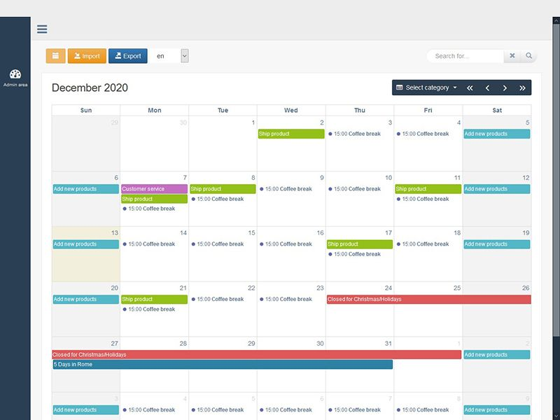
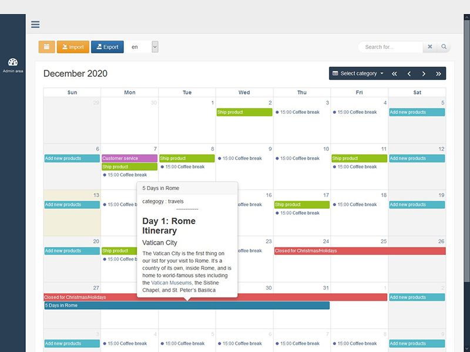
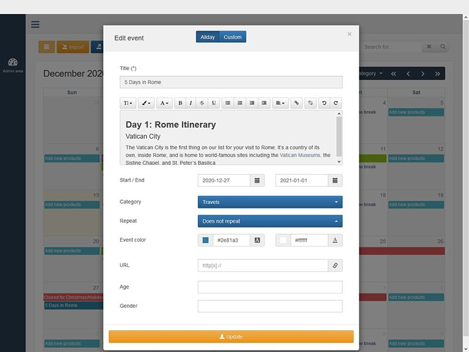
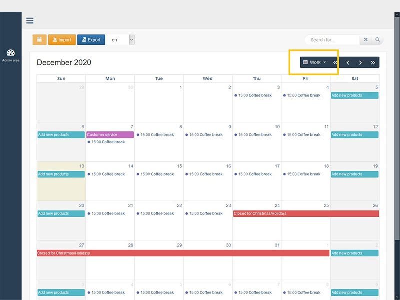
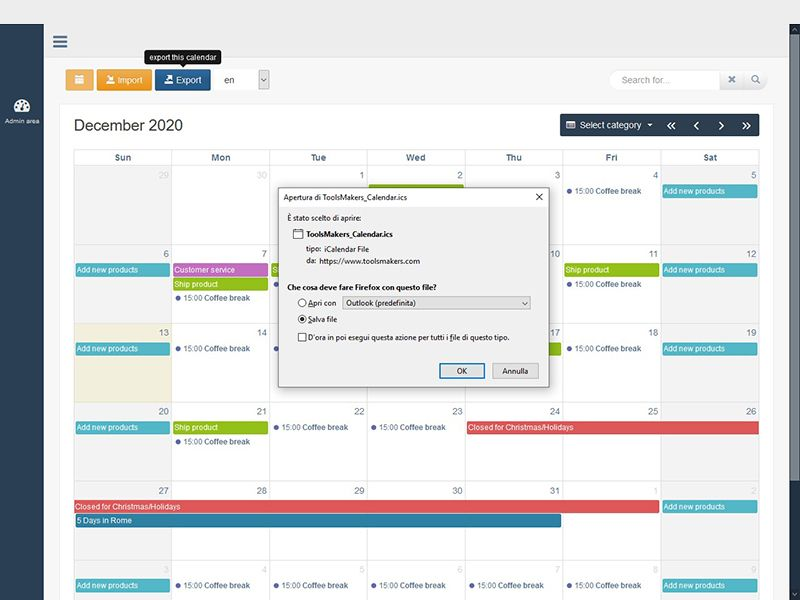
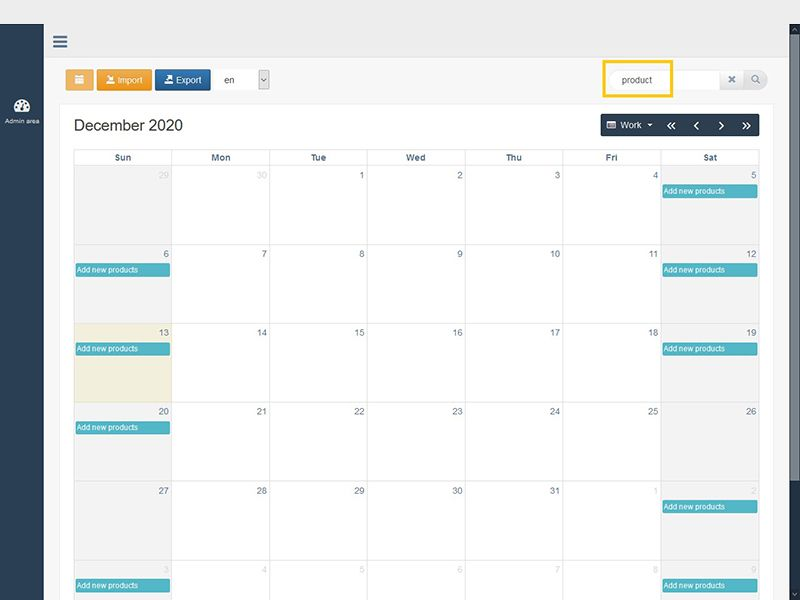

# Calendar Maker

Featured Calendar Maker v1.0 multingual extends the functionalities of the latest version of the FullCalendar (5.3.2), the most popular and completed JavaScript Calendar open source.

It consists of a plugin jQuery (calendarMaker.js) and a PHP class (calendarMaker.php) which makes available both the main functions used for Calendar management such as
entry, modifying and deleting events, and authentication ones, since our solution is fully manageable by one or more administrators through the backend private area.

Featured Calendar Maker v1.0 is a complete and fully customizable software solution that allows to manage infinite calendars in any language with simple or recurring events. Each calendar can be used for numerous activities (blogs, events, travels, reservationes, etc..) and is different contexts thanks to the possibility of associating categories customized fields. All events, both proprietary and imported can be filtered by categories and/or keywords to facilitates the search.

## Features

- Multi-Language, Fully Customized
- 100% Responsive Design
- Powerful Admin Panel
- Create unlimited calendar
- Add/Edit/Delete/View/Export/Update calendar events
- Rules Implemented for Recurring Events
- WYSIWYG editor for Events Description
- Create Custom Categories
- Create Custom Fields
- Toolbar for Search/Filter Events
- Toolbar for Import/Export Calendars
- Update Events on Drag and Resize
- Export Calendar or Events to ICAL format
- PHP & JS Versions with PHP Class
- UTF-8 Ready
- Easy to Install
- Demo Included
- Documentation Included
- 

## Requirements

- PHP 5.6+
- PDO PHP Extension
- MySQL 5.x

## ⌛ Installation

  1. Unzip the archive containing the calendarMaker application.

  2. In the resulted folder, you’ll find a folder named “calendarmaker”.
  
  3. Move or upload this folder to your server in the document root, that is, /home/username/public_html most likely.

  4. Point your browser to the install  directory, i.e: <https://www.yourdomain.com/calendarmaker/install>

  5. After installing, make sure you remove the install folder from your host ( the folder that is called install ).

  6. Go to <https://www.yourdomain.com/admin> and access to the backend area

  7. Click menu Help and read “Getting Started”

### 🖥️ Demo

